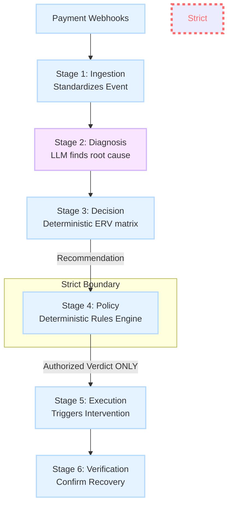
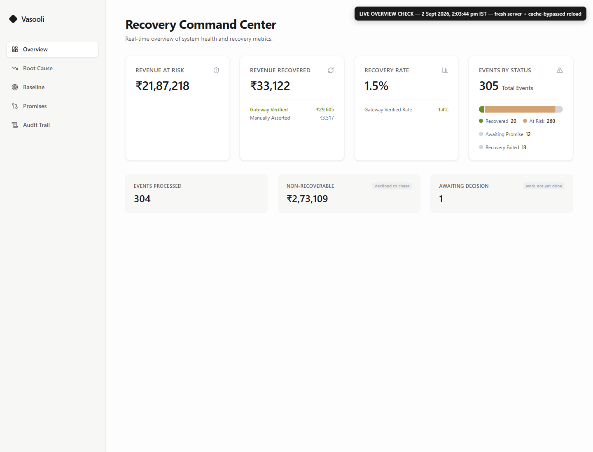
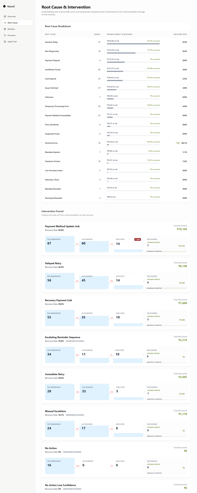
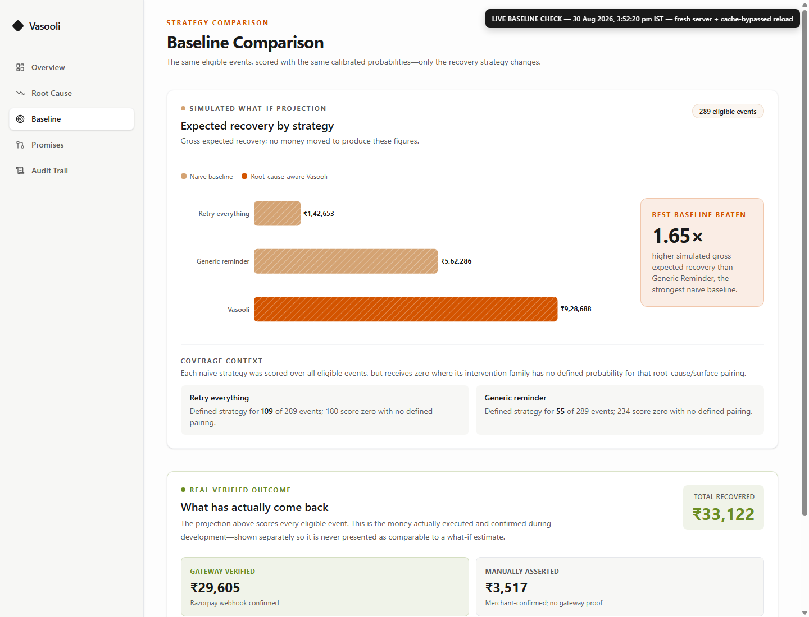
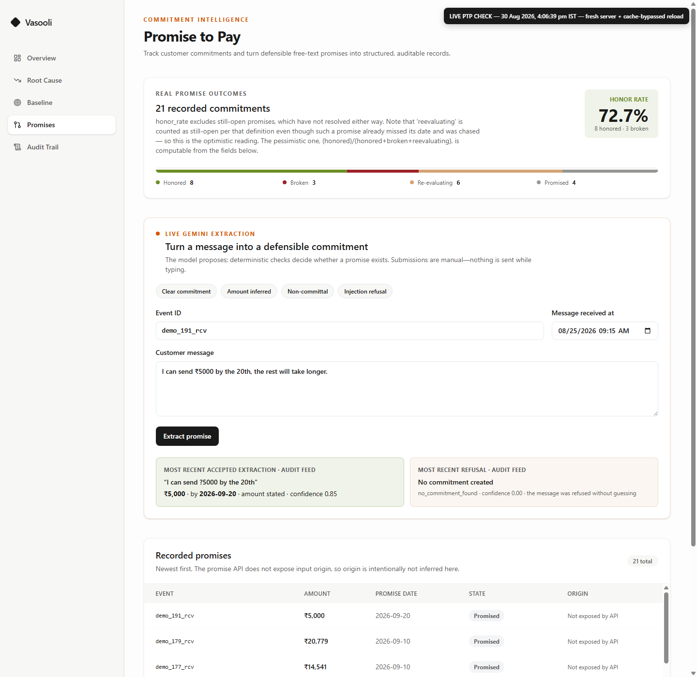
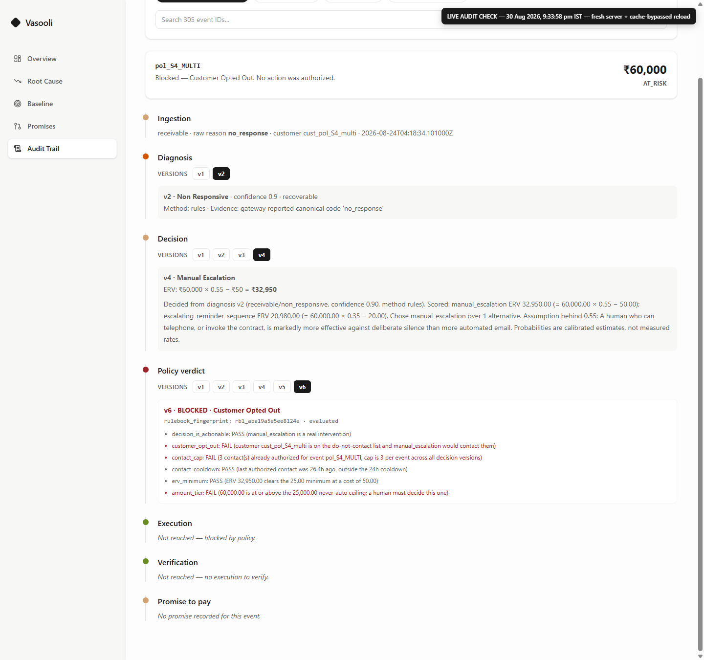

# Vasooli
**A Root-Cause-Aware Revenue Recovery Agent for Failed Payments**

Built for the Razorpay Buildathon, Track 03. *Don't retry the payment. Diagnose the leak, choose the right recovery, and prove the money came back.*

## The Problem
Standard payment recovery tools rely on blind retries or generic reminders that annoy customers and fail to address the actual reason a payment failed. By diagnosing the true root cause-whether it's a technical error, an expired card, or a temporary cash flow issue—a recovery system can choose the correct intervention, dramatically outperforming standard "retry-everything" baselines.

## The Solution
Vasooli replaces blind retries with an intelligent pipeline:
1. **Ingestion**: Standardizes webhooks and API events from payment gateways into a unified format.
2. **Diagnosis**: Gemini classifies the root cause from event context and customer history.
3. **Decision**: A deterministic engine scores every candidate intervention by Expected Recovery Value (ERV) using a fixed probability matrix — no LLM involved.
4. **Policy**: A rules engine evaluates the recommendation against hard business constraints (caps, cooldowns, autonomy tiers).
5. **Execution**: If authorized, the system triggers the intervention (e.g., generating a payment link or sending a reminder).
6. **Promise-to-Pay**: Extracts payment commitments from free-text customer messages (LLM-assisted), then tracks them through a safety gate that never chases a customer who has already paid — the gate is a frozen token with a 60-second TTL, unforgeable outside one module.

## Core Architectural Principle
**The LLM proposes, but the Policy Layer disposes.** To guarantee safety, Gemini never directly executes or authorizes a financial action; it only generates a recommendation. A separate deterministic policy engine evaluates this recommendation, and the executor *only* accepts digitally signed authorizations from the policy engine. 
*Proof:* In the audit log, a highly-confident recommendation to automatically write off a ₹60,000 debt is explicitly blocked by the `amount_tier` policy check, proving the AI cannot bypass business limits.

## Tech Stack
| Component | Technology |
| --- | --- |
| **Backend** | Python 3.12, FastAPI, Motor |
| **Database** | MongoDB Atlas |
| **AI / LLM** | Google Gemini (`gemini-3.5-flash-lite`, `gemini-3.6-flash`) |
| **Frontend** | React 19, Vite, Tailwind CSS 4 |
| **Payment Gateway** | Razorpay |

## Architecture


## Key Features
- **Root-Cause Awareness:** Distinguishes between 18 root causes across 4 revenue surfaces (payments, checkouts, subscriptions, receivables).
- **Expected Recovery Value (ERV):** Scores every candidate intervention against a fixed probability matrix; picks the one with the highest net expected return.
- **Bounded Autonomy:** Hard limits on what the system can authorize without human approval (₹5k auto ceiling, ₹25k never-auto floor, 3-contact cap, 24h cooldown).
- **Rulebook Fingerprinting:** Every policy verdict is stamped with a SHA-256 hash of the exact parameters in force, so historical decisions are auditable even after the rules change.
- **Safe Promise-to-Pay (PTP):** Extracts commitments from free-text, verified by deterministic bounds checks (date horizon, amount cap, paid-status gate).
- **Audit Trail Explorer:** Per-event timeline showing every diagnosis, decision, policy verdict (with all six checks), execution, and verification — the full chain of evidence in one view.
- **Dual Verification Split:** Every recovery figure is reported as gateway-verified (Razorpay webhook with signature check) vs. manually-asserted (merchant confirmation). The two are never blended into one number.

## Real Results
The following metrics are pulled directly from the live `GET /metrics/summary` and `GET /metrics/baseline-comparison` endpoints on our synthetic dataset of 305 revenue-at-risk events across payments, checkouts, subscriptions, and receivables:

**Recovery Performance (Actuals)**
| Metric | Value |
| :--- | :--- |
| **Total Revenue at Risk** | ₹21,87,218.02 |
| **Gateway Verified Recovered** | ₹29,605.14 |
| **Headline Recovery Rate (Verified)** | **1.35%** |
| **Cohort Recovery Rate (Link-producing)** | **39.53%** |

**Baseline Comparison (Simulated Expected Value)**
| Strategy | Gross Expected Recovery |
| :--- | :--- |
| Baseline: Retry Everything | ₹1,42,653.43 |
| Baseline: Generic Reminder | ₹5,62,286.04 |
| **Vasooli AI Recommended** | **₹9,28,687.91** |

*Vasooli outperforms the best baseline strategy by **1.65×**.*

## Screenshots
| Overview Dashboard | Root Cause Analysis |
|:---:|:---:|
|  |  |

| Baseline Comparison | Promise to Pay |
|:---:|:---:|
|  |  |

| Audit Trail |
|:---:|
|  |

## Setup & Local Development

1. **Clone and Install Backend**
```bash
python -m venv .venv
source .venv/bin/activate  # Or .\.venv\Scripts\activate on Windows
pip install -r requirements.txt
```

2. **Environment Variables** (create `.env` in root)
```env
MONGODB_URI=your_mongodb_uri
GEMINI_API_KEY=your_gemini_key
GEMINI_MODEL=gemini-3.6-flash          # primary model; gemini-3.5-flash-lite is the quota-fallback
RAZORPAY_KEY_ID=your_rzp_key
RAZORPAY_KEY_SECRET=your_rzp_secret
```

3. **Run Backend**
```bash
uvicorn app.main:app --port 8124
```

4. **Run Frontend**
```bash
cd frontend
cp .env.example .env  # or create .env with:
# VITE_API_BASE_URL=http://127.0.0.1:8124
npm install
npm run dev
```

## Known Limitations
1. **Simulated Payments:** All recovered money reported here is simulated via Razorpay payment links. No payment was genuinely completed end-to-end because Razorpay's hosted checkout requires manual browser interaction.
2. **Razorpay Link Cap:** Razorpay test-mode accounts have a strict 30-link lifetime cap per merchant account, limiting large-scale test executions.
3. **Manual Verifications:** Contact-type interventions (like reminders) are structurally unverifiable by gateway webhooks and require a merchant's manual confirmation to count as recovered.

## Build Challenges & Technical Obstacles

**Enforcing the LLM-recommends/policy-authorizes split structurally, not by convention.** It's easy to say "the AI only recommends" — proving it required making unauthorized action literally unconstructable in code. The `Decision` model has no field for authorization or execution and rejects any attempt to add one; the executor's input type only accepts an already-authorized verdict, so there's no code branch to bypass because a blocked verdict can't even be constructed as its argument. We adversarially tested this with a prompt-injection attempt requesting a ₹91,000 refund — the type system silently discarded it.

**Diagnosing Razorpay's real test-mode limits.** Test-mode payment links have a hidden 30-link *lifetime* cap per account, separate from a burst limit of roughly 5 creates per minute. We initially misdiagnosed the burst limit as the lifetime cap, since both produced an identical "5 succeed, then refused" symptom on different accounts for different reasons. Resolving it required isolating each limit with targeted API probes rather than trusting the first plausible explanation.

**Making historical policy decisions provably re-derivable after rules change.** Business rules get tuned during development, but old decisions still needed to be explainable under the rules actually in effect when they were made — not silently reinterpreted under today's rules. We fingerprint every policy verdict with a hash of its exact rulebook parameters, so any verdict can be replayed and verified against its own historical rulebook.

**Closing a race condition in Promise-to-Pay's safety check.** The obvious implementation - check payment status, then branch - doesn't guarantee the check actually happened before a follow-up fires. We closed this by making "customer hasn't paid" a short-lived, unforgeable token that the follow-up function requires as a mandatory argument: there is no code path that sends a follow-up without holding proof of that check.

## What's Next
- **End-to-End Test Automation:** Implement browser automation (Playwright/Puppeteer) to programmatically complete Razorpay checkouts and trigger real webhooks.
- **Automated PTP Scheduler:** Build a cron-driven scheduler to automatically follow up on promises-to-pay when their horizon dates pass.
- **Multi-Currency Support:** Add live FX conversion to support international payment gateways and non-INR events.

## Documentation
- **[ARCHITECTURE.md](ARCHITECTURE.md)** — Full technical reference: data models, intervention matrix, policy rulebook, fingerprinting, verification sources, and the four-layer recommend/authorize boundary.
- **[PITCH_NOTES.md](PITCH_NOTES.md)** — Five-minute live demo script with exact event IDs, pre-filled chips, anticipated judge Q&A, and the numbers you must not misquote.
